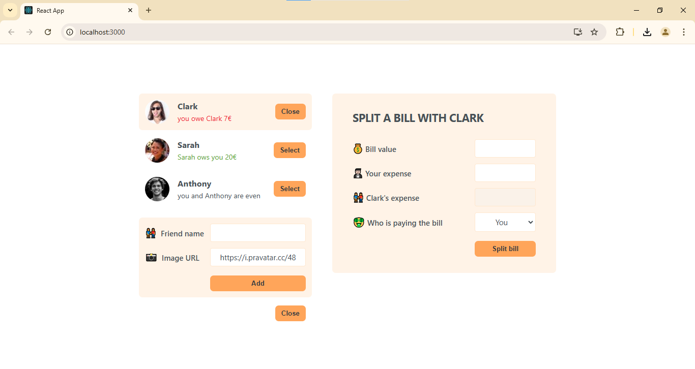

# Eat-n-Split

Eat-n-Split is a simple yet powerful app designed to help groups split bills efficiently and accurately. Whether you're dining out with friends or sharing expenses during a trip, Eat-n-Split automatically calculates how much each person owes and simplifies the process of dividing expenses. No more manual calculations—just input the total bill and the app does the rest.

## Features

- **Automatic Bill Splitting**: Split the total bill evenly among participants or customize individual amounts.
- **Tax and Tip Calculation**: Automatically calculates tax and tip based on the total bill.
- **Multiple Participants**: Add multiple people to a bill and split the total in any way you want.
- **Easy-to-Use Interface**: Simple and intuitive design for quick bill splitting.

## Technologies Used

- **Frontend**: React, JavaScript, HTML, CSS
- **Backend**: Node.js (If applicable, please provide additional backend details)
- **Database**: (If applicable, specify database here)
- **Other Dependencies**: List any external libraries or frameworks

## Installation

### Prerequisites

Before getting started, ensure you have the following installed:

- Node.js
- npm (Node Package Manager)

### Steps

1. Clone the repository to your local machine:

   ```bash
   git clone https://github.com/NeenduDev/eat-n-split.git
   ```

2. Navigate into the project directory:

   ```bash
   cd eat-n-split
   ```

3. Install the required dependencies:

   ```bash
   npm install
   ```

4. Run the application locally:

   ```bash
   npm start
   ```

   This will launch the application at `http://localhost:3000`.

## Usage

1. Open the app in your browser after running it locally.
2. Add the total amount of your bill.
3. Enter the number of people or individuals and specify how much each person contributed (optional).
4. Click "Split" to see the calculated amount each person owes.

## Demo

Check out the live demo of the eat-n-split on [GitHub Pages](https://neendudev.github.io/eat-n-split/).

## Screenshots



## Contributing

Contributions are welcome! If you want to improve the project, follow these steps:

1. Fork the repository.
2. Create a new branch (`git checkout -b feature-name`).
3. Make your changes and commit them (`git commit -am 'Add new feature'`).
4. Push to the branch (`git push origin feature-name`).
5. Create a new pull request.

## License

This project is licensed under the MIT License - see the [LICENSE](./LICENCE.txt) file for details.

## Acknowledgements

- Inspiration from other bill-splitting apps.
- Thanks to all contributors and open-source libraries used in this project.
